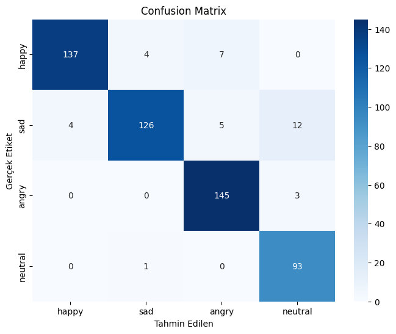
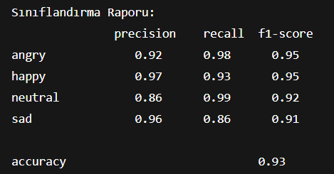
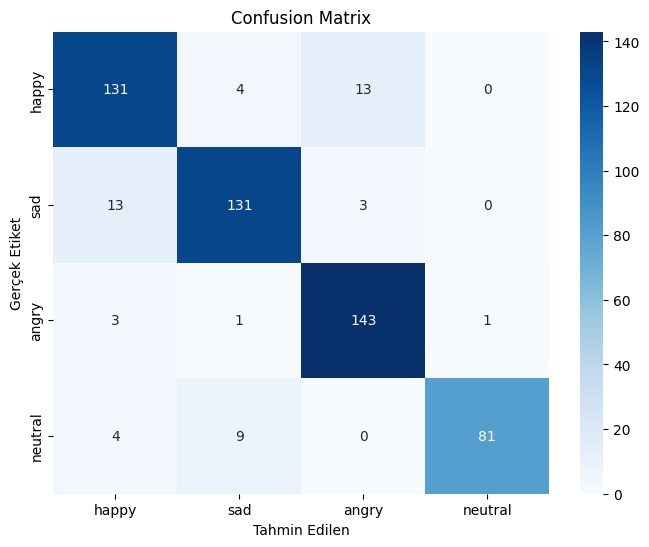
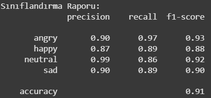

# 🎙️ Speech Emotion Recognition (SER) Project

This project is a machine learning system designed to detect emotional states from speech signals. It utilizes **MFCC (Mel-frequency cepstral coefficients)** for feature extraction and employs **SVM, MLP, and Random Forest** algorithms for classification.

The highest performance was achieved using the **MLP (Multi-Layer Perceptron)** algorithm with an **accuracy rate of 93.3%**.

## 📋 Table of Contents
- [About the Project](#-about-the-project)
- [Datasets](#-datasets)
- [Methodology & Feature Extraction](#-methodology--feature-extraction)
- [Models Used](#-models-used)
- [Results & Performance](#-results--performance)

## 💡 About the Project
Emotion recognition systems play a critical role in various technological fields today, such as customer service (call centers), recommendation systems, and user experience enhancement. The primary goal of this study is to classify emotional tones from raw audio data with high accuracy.

Within the scope of this project, audio files were analyzed, converted into digital signals, and model performance was maximized through extensive hyperparameter optimization.

## 📊 Datasets
Two distinct and popular datasets were used for model training and validation:

1.  **RAVDESS (The Ryerson Audio-Visual Database of Emotional Speech and Song):**
    * Used as the primary dataset for training.
    * Audio files were analyzed based on language, accent, and sentence length for effective preprocessing.
2.  **TESS (Toronto Emotional Speech Set):**
    * Used to validate the success and generalization capability of the trained models with an external dataset.

## ⚙️ Methodology & Feature Extraction
To extract meaningful features from audio files that the computer can process, the **MFCC (Mel-frequency cepstral coefficients)** technique was employed.

* **Pipeline:** Audio File ➡️ Signal Processing ➡️ MFCC Conversion ➡️ Numerical Matrix ➡️ Model Input

## 🧠 Models Used
In this study, three fundamental machine learning algorithms were analyzed comparatively:

* **MLP (Multi-Layer Perceptron):** Neural network-based classification.
* **SVM (Support Vector Machine):** For finding the optimal hyperplane.
* **RF (Random Forest):** Ensemble learning method.

*Various hyperparameter variations were tested (Grid Search / Random Search) for each model, and the best results are reported.*

## 🏆 Results & Performance
The trained models were evaluated based on the **Confusion Matrix**, **Precision**, **Recall**, and **F1-Score** metrics.

| Model | Best Accuracy Rate |
| :--- | :--- |
| **MLP (Multi-Layer Perceptron)** | **93.3%** 🌟 |
| Random Forest | *90.32%* |
| SVM (Support Vector Machine) | *99%(Overfitting)* |

*> Note: Prediction operations performed with the TESS dataset confirmed the high success rate and generalization ability of the MLP model.*

 ## Classifier Results
 
 <h3>MLP Model Results</h3>
<table>
  <tr>
    <td align="center"><b>Confusion Matrix</b></td>
    <td align="center"><b>Classification Report</b></td>
  </tr>
  <tr>
    <td></td>
    <td></td>
  </tr>
</table>

 <h3>RF Model Results</h3>
<table>
  <tr>
    <td align="center"><b>Confusion Matrix</b></td>
    <td align="center"><b>Classification Report</b></td>
  </tr>
  <tr>
    <td></td>
    <td></td>
  </tr>
</table>

